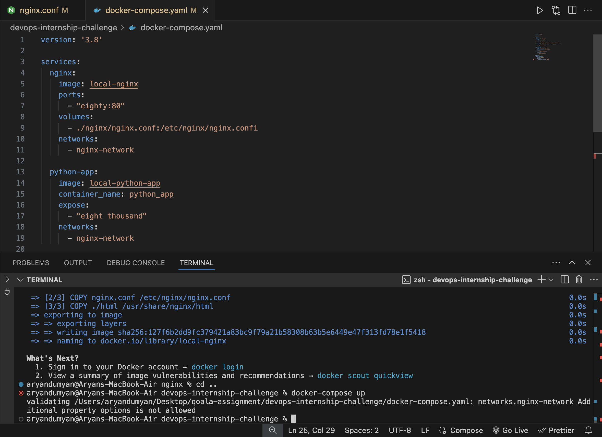
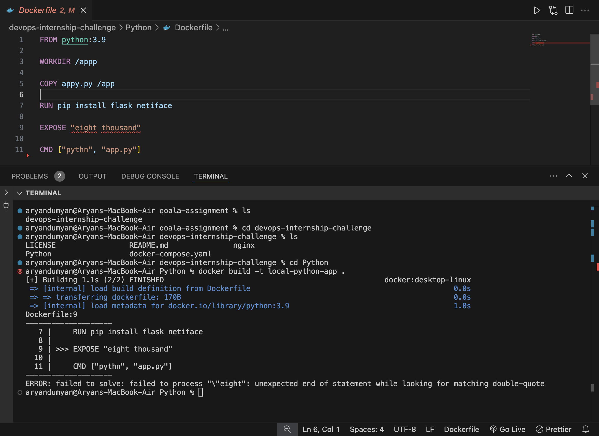
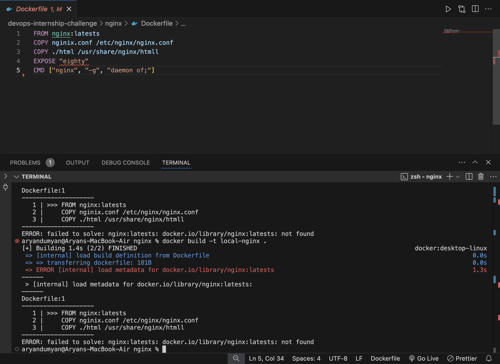
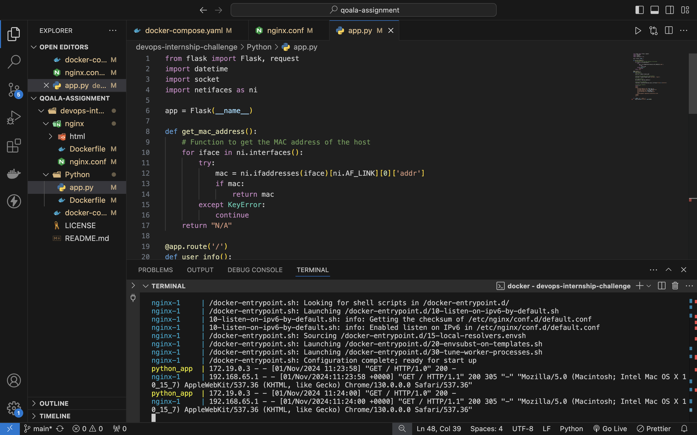
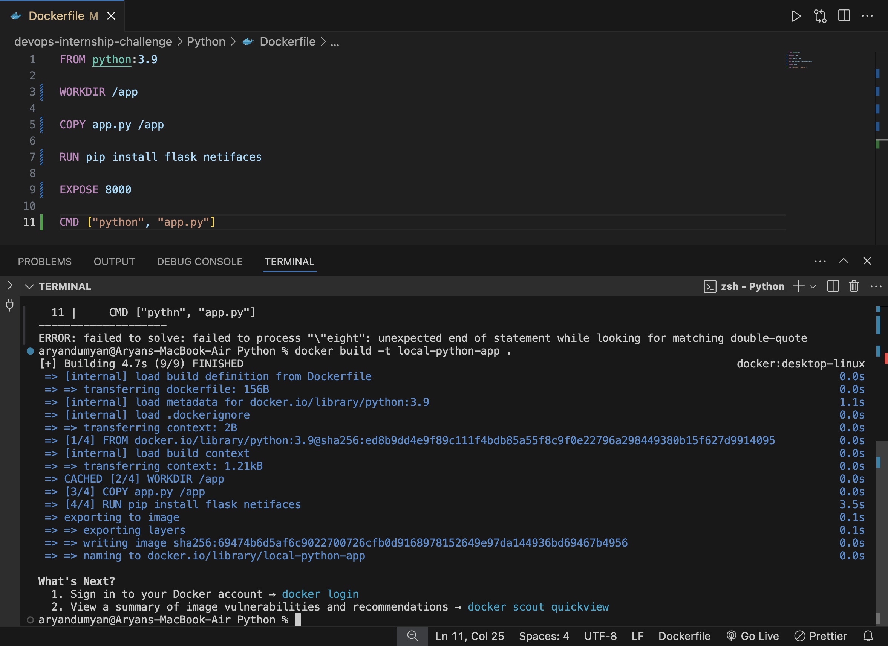
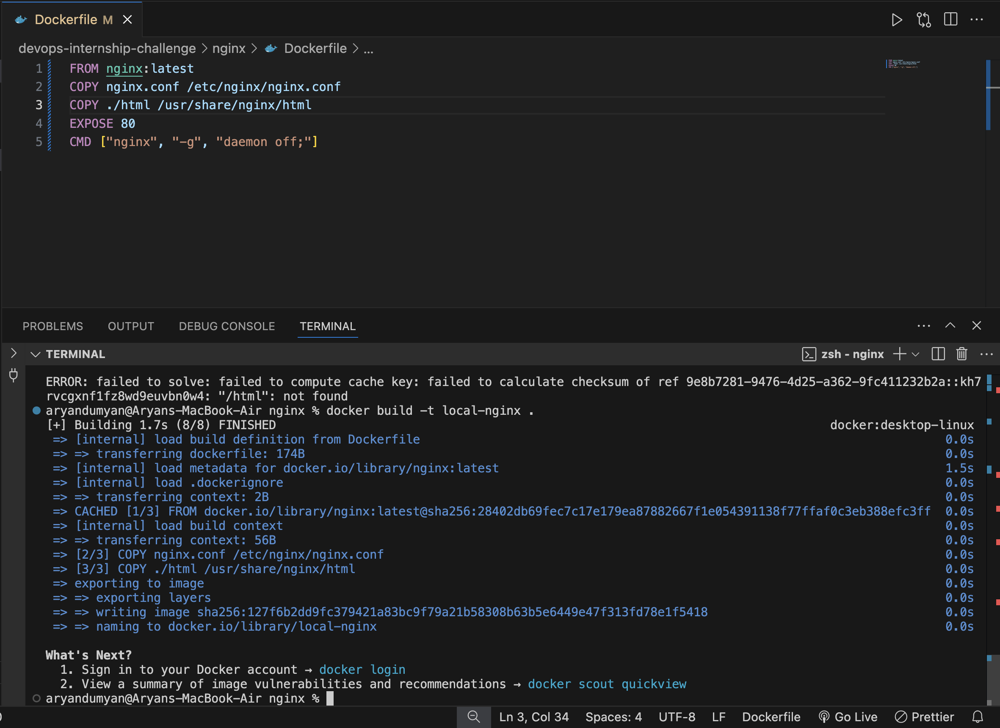
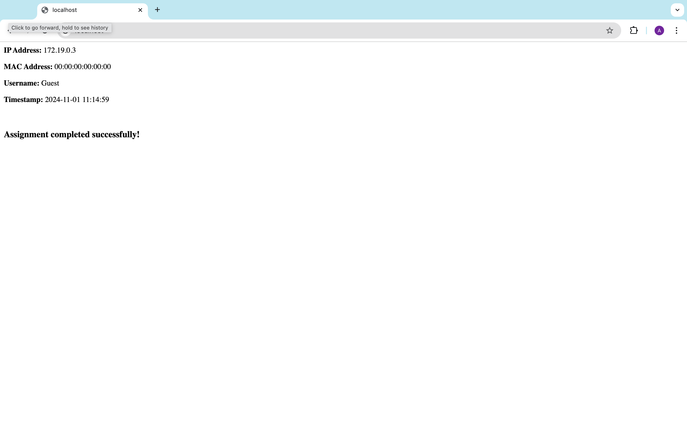

# DevOps Assignment: Debugging and Running a Dockerized Application

## Objective
Debug, fix, and successfully deploy a Dockerized application.

## Table of Contents
1. [Assignment Overview](#assignment-overview)
2. [Setup and Tools](#setup-and-tools)
3. [Steps to Completion](#steps-to-completion)
   - [Initial Setup](#initial-setup)
   - [Running the Application](#running-the-application)
   - [Debugging Process](#debugging-process)
4. [Screenshots](#screenshots)
   - [Before Corrections](#before-corrections)
   - [After Corrections](#after-corrections)
5. [Results](#results)
6. [Bonus Cloud Deployment](#bonus-cloud-deployment)

## Assignment Overview
This assignment involved debugging and deploying a Dockerized application with an Nginx server and a Python-based web service. Below is a step-by-step account of the process, debugging steps, and final outcomes.

## Setup and Tools
- **System Requirements**: Laptop, PC, or cloud server
- **Tools**: Docker, Docker Compose

## Steps to Completion

### Initial Setup
1. **Cloning the Repository**:
   - Cloned the GitHub repository containing the Dockerfiles, `docker-compose.yml`, and application code.

2. **Building Docker Images**:
   - Built Docker images locally using the provided Dockerfiles for Nginx and Python applications
   - Tagged each image appropriately for referencing in the `docker-compose.yml`

### Running the Application
1. **Starting Containers**:
   - Launched all containers using `docker-compose up`
   - Observed intentional errors during the startup, requiring debugging in Dockerfiles and configuration files

### Debugging Process

#### Issues Identified
1. **Docker Compose**:
   - Incorrect `ports` and `expose` values (e.g., "eighty" and "eight thousand" instead of numbers)
   - Typos in network driver names and options

2. **Python App**:
   - `WORKDIR` and `COPY` paths were incorrect
   - Missing `python` command in CMD instruction

3. **Nginx**:
   - Incorrect paths and typos in `nginx.conf` file (e.g., "mime.typess," "htmll")
   - Errors in `EXPOSE` and `CMD` statements in the Dockerfile

#### Resolution Steps
1. **Correcting Docker Compose File**:
   - Fixed typos in `ports`, `expose`, and `networks` fields

2. **Python App Dockerfile**:
   - Corrected `WORKDIR` and `COPY` paths
   - Fixed typos in `CMD` line

3. **Nginx Configuration**:
   - Corrected file paths in the `Dockerfile` and `nginx.conf`
   - Fixed `EXPOSE` and `CMD` typos for proper container startup

4. **Testing**:
   - Verified application accessibility at http://localhost
   - Checked Nginx logs to confirm request handling

## Screenshots

### Before Corrections
1. **Docker Compose Errors**:
   - 

2. **Python App Dockerfile Errors**:
   - 

3. **Nginx Dockerfile Errors**:
   - 

### After Corrections
1. **Docker Compose Success**:
   - 

2. **Python App Dockerfile Success**:
   - 

3. **Nginx Configuration Success**:
   - 

### Final Simulation
   - 

## Results
- **Application Status**: Successfully running and accessible on http://localhost
- **Log Verification**: Confirmed request logs in Nginx, indicating successful communication with the Python app

## Bonus Cloud Deployment
Deployed the application on a cloud server for external access.
Access URL: `[will post after deployment]`

## Conclusion
This assignment involved identifying multiple intentional errors across Dockerfiles, `docker-compose.yml`, and configuration files. By documenting each issue and resolution, I demonstrated a systematic approach to debugging a Dockerized application.
